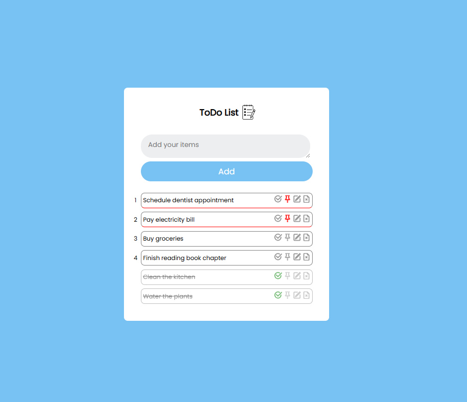

# To-Do List App

A simple and convenient task management app developed in JavaScript using Local Storage. This application allows users to easily create, edit, reorder, pin, and delete tasks, as well as mark tasks as completed. Data is stored in local storage, so the task list remains accessible even after closing the browser.

## Features

- **Add Task** — create new tasks with descriptions.
- **Delete Task** — remove tasks that are no longer needed.
- **Edit Task** — update existing tasks as needed.
- **Move Task** — rearrange tasks to better manage priorities.
- **Pin Task** — pin important tasks to the top of the list.
- **Complete Task** — mark tasks as completed to track progress.

## Technologies Used

- **JavaScript** — main programming language for application functionality.
- **HTML/CSS** — basic structure and styling to enhance the app’s visual appeal.
- **Local Storage** — client-side data storage to maintain tasks between sessions.

## Installation and Setup

1. Clone the repository:
    ```bash
    git clone https://github.com/OksanaNova/todo-list-app.git
    ```
2. Navigate to the project directory:
    ```bash
    cd todo-list-app
    ```
3. Open the `index.html` file in your browser to launch the app.

## Screenshots



## Additional Information

This project is designed as a learning exercise but follows principles of modularity and usability. Future features may include:

- Task deadline notifications.
- Dark theme.